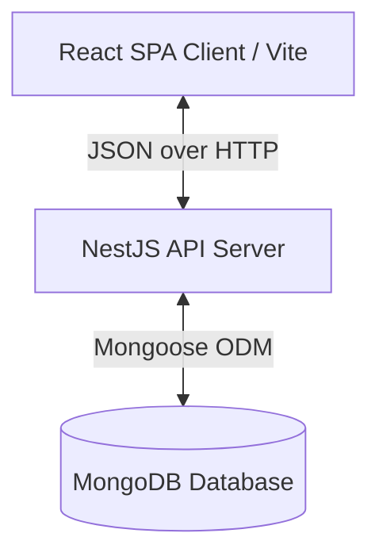

# System Architecture — Jewelry Billing & Shop Management System

This document outlines the architectural patterns, technology stack, directory organization, state management, and design system choices for the Jewelry Billing & Shop Management System.

---

## 1. System Overview

The system is split into two primary components:
1. **Frontend Client**: A client-side Single Page Application (SPA) built using **React + TypeScript + Vite** and styled with **Material UI (MUI)**.
2. **Backend Server**: A server-side API application built using **NestJS + TypeScript** which manages core business logic, database transactions via Mongoose, and authentication.



---

## 2. Frontend Architecture

### Core Technologies
- **React 19**: Modern declarative UI framework.
- **Vite**: Ultra-fast build tool and bundler.
- **Material UI (MUI) v9**: Core component library, configured with a custom jewelry-focused design system.
- **React Router v7**: Declarative routing for page navigation.
- **React Hook Form & Zod**: Form management and schema validation.

### Directory Structure
```text
frontend/src/
├── app/          # App-wide routing configuration and bootstrap
├── components/   # Application Shell and shared reusable UI elements
│   ├── Layout/   # AppShell, Sidebar, Breadcrumbs, Menus
│   └── shared/   # PageHeader, StatCard, DataTable, MoneyDisplay, etc.
├── context/      # Global state providers (e.g. Snackbar Notification System)
├── features/     # Feature-oriented pages and modules
│   ├── dashboard/
│   ├── billing/
│   ├── bills/
│   ├── customers/
│   ├── products/
│   └── ...
├── theme/        # Centralized MUI theme configuration (colors, typography, components)
├── types/        # Reusable domain-wide TypeScript definitions
└── utils/        # Generic utilities (formatting, date calculations)
```

---

## 3. Backend Architecture

### Core Technologies
- **NestJS**: Modular TypeScript node framework.
- **MongoDB & Mongoose**: Document database and Object Document Mapper (ODM).

### Architectural Layers
To guarantee strict separation of concerns, the application follows a layered design:

```text
Request ──> Controller ──> Feature Service ──> Calculation Engine ──> Repository/Model ──> Database
```

1. **Controllers**: Define route endpoints and manage request/response serialization.
2. **Services / Business Logic**: Execute core domain logic, perform authentication/authorization checks, and process transactions.
3. **Calculation Engine**: Centralized class/service responsible for financial calculations (calculating making charges, discounts, taxes, and final due balances). **Never calculate totals independently on the frontend.**
4. **Mongoose Models**: Define Mongo schemas, schemas validations, and compound indexes.

---

## 4. UI Design System (MUI Theme)

The UI is optimized for a premium modern jewelry retail store operating on Windows desktop POS systems, while maintaining full responsiveness on mobile/tablet screens.

### Design Principles
- **Color Palette**: Alabaster/warm white background surfaces (`#FAF9F6`), primary muted champagne/gold accent (`#C5A880`), secondary metallic gold (`#D4AF37`), charcoal typography (`#1C1C1C`), and soft warm dividers (`#EBE9E4`).
- **Typography**: Editorial header typography ("Playfair Display", serif) combined with a clean sans-serif font for table records ("Inter").
- **Grid Layout**: Responsive grid utilizing MUI breakpoints (`xs`, `sm`, `md`, `lg`, `xl`). Desktop-first optimization for high-density billing entry.
- **Elevation**: Minimal shadows (`0px 2px 8px rgba(0,0,0,0.02)`), crisp borders, and soft padding to reflect standard financial ledgers.

---

## 5. Security & Error Handling

- **Data Validation**: Strict runtime schema validations (Zod on the frontend, NestJS ValidationPipes on the backend).
- **Global Error Boundary**: High-level React Error Boundary to catch runtime rendering errors and present a user-friendly recovery interface.
- **Unified Alert System**: React Context-based Snackbar system (`showSuccess`, `showError`, `showWarning`, `showInfo`) to replace standard browser alert calls.
- **Passwords & Secrets**: Encrypted passwords using `bcrypt`. Secrets loaded via system environment variables (`.env`).
