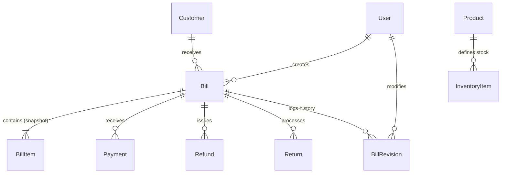

# Database Schema & Models — Jewelry Billing & Shop Management System

This document outlines the final production Mongoose schemas, properties, relations, query indexing strategies, and transactional database safety rules.

---

## 1. Database Entity Relationship Diagram

---

## 2. Collections and Schema Definitions

All models are built as standard NestJS `@Schema()` compiled classes.

### 2.1. User Schema (`users`)
Stores store operators and login credentials.
- `name`: String (Required)
- `email`: String (Required, unique, indexed, lowercase)
- `passwordHash`: String (Required)
- `role`: String (Required, Enum: `ADMIN`, `MANAGER`, `SALES`, `VIEWER`, Default: `SALES`)
- `isActive`: Boolean (Default: `true`)
- Timestamps: `createdAt`, `updatedAt`

### 2.2. Customer Schema (`customers`)
Stores contact information for clients.
- `customerCode`: String (Required, unique, indexed, uppercase)
- `name`: String (Required, indexed)
- `phone`: String (Required, unique, indexed)
- `alternatePhone`: String (Optional)
- `email`: String (Optional, lowercase)
- `address`: String (Optional)
- `city`: String (Optional)
- `state`: String (Optional)
- `pincode`: String (Optional)
- `gstin`: String (Optional, uppercase)
- `notes`: String (Optional)
- Timestamps: `createdAt`, `updatedAt`

### 2.3. Product Schema (`products`)
Catalogs template designs (non-serialized).
- `sku`: String (Required, unique, indexed, uppercase)
- `barcode`: String (Required, unique, indexed)
- `name`: String (Required)
- `category`: String (Required, indexed)
- `metal`: String (Required, Enum: `GOLD`, `SILVER`, `PLATINUM`, uppercase)
- `purity`: String (Required)
- `description`: String (Optional)
- `defaultMakingCharge`: Number (Default: `0`)
- `defaultWastage`: Number (Default: `0`)
- `stoneDetails`: String (Optional)
- `active`: Boolean (Default: `true`)
- Timestamps: `createdAt`, `updatedAt`

### 2.4. InventoryItem Schema (`inventoryitems`)
Individual physical jewelry units (serialized, in-stock).
- `productId`: ObjectId (Ref: `Product`, required, indexed)
- `sku`: String (Required, indexed, uppercase)
- `barcode`: String (Required, unique, indexed)
- `metal`: String (Required, Enum: `GOLD`, `SILVER`, `PLATINUM`, uppercase)
- `purity`: String (Required)
- `grossWeight`: Number (Required, weight in grams)
- `stoneWeight`: Number (Default: `0`)
- `otherWeight`: Number (Default: `0`)
- `netWeight`: Number (Required, automatically calculated: `grossWeight - stoneWeight - otherWeight` on pre-validate hook)
- `purchasePrice`: Number (Optional)
- `sellingPrice`: Number (Optional)
- `makingCharge`: Number (Optional)
- `wastage`: Number (Optional)
- `status`: String (Required, Enum: `IN_STOCK`, `SOLD`, `RESERVED`, `RETURNED`, `DAMAGED`, Default: `IN_STOCK`, indexed)
- `location`: String (Optional)
- Timestamps: `createdAt`, `updatedAt`

### 2.5. Bill Schema (`bills`)
Retail sales invoices posted in the shop. Uses subdocument snapshots to avoid mutation propagation from catalog tables.
- `invoiceNumber`: String (Required, unique, indexed, uppercase)
- `customerSnapshot`: Subdocument:
  - `customerId`: ObjectId
  - `customerCode`: String
  - `name`: String (Required)
  - `phone`: String (Required)
  - `gstin`: String
  - `address`: String
- `itemsSnapshot`: Array of `BillItem` Subdocument:
  - `productId`: ObjectId
  - `productName`: String (Required)
  - `sku`: String
  - `metal`: String (Required, Enum: `GOLD`, `SILVER`, `PLATINUM`, uppercase)
  - `purity`: String (Required)
  - `grossWeight`: Number (Required)
  - `stoneWeight`: Number (Default: `0`)
  - `otherWeight`: Number (Default: `0`)
  - `netWeight`: Number (Required, computed on validation)
  - `metalRate`: Number (Required, locked spot metal rate per gram)
  - `metalValue`: Number (Required, netWeight * metalRate)
  - `makingChargeType`: String (Required, Enum: `FIXED`, `PER_GRAM`, `PERCENTAGE`)
  - `makingChargeRate`: Number (Required)
  - `makingChargeAmount`: Number (Required)
  - `wastageType`: String (Required, Enum: `PERCENTAGE`, `GRAMS`, `NONE`, Default: `NONE`)
  - `wastageRate`: Number (Default: `0`)
  - `wastageAmount`: Number (Default: `0`)
  - `stoneCharge`: Number (Default: `0`)
  - `otherCharge`: Number (Default: `0`)
  - `discount`: Number (Default: `0`)
  - `taxableAmount`: Number (Required)
  - `tax`: Number (Required, GST tax value)
  - `finalAmount`: Number (Required)
- `rateSnapshot`: Subdocument:
  - `rates`: Array of:
    - `metalType`: String (Enum: `GOLD`, `SILVER`, `PLATINUM`)
    - `purity`: String
    - `ratePerGram`: Number
- `pricingSnapshot`: Subdocument:
  - `subtotal`: Number (Required)
  - `makingChargesTotal`: Number (Required)
  - `wastageChargesTotal`: Number (Required)
  - `stoneChargesTotal`: Number (Required)
  - `otherChargesTotal`: Number (Required)
  - `discountAmount`: Number (Required)
  - `taxableAmount`: Number (Required)
  - `taxAmount`: Number (Required)
  - `finalAmount`: Number (Required)
- `paymentSummary`: Subdocument:
  - `paidAmount`: Number (Required, Default: `0`)
  - `outstandingAmount`: Number (Required)
- `status`: String (Required, Enum: `DRAFT`, `UNPAID`, `PARTIALLY_PAID`, `PAID`, `OVERDUE`, `CANCELLED`, `RETURNED`, `REFUNDED`, Default: `DRAFT`, indexed)
- `dueDate`: Date (Required, indexed)
- `notes`: String (Optional)
- `createdBy`: ObjectId (Ref: `User`, required)
- `updatedBy`: ObjectId (Ref: `User`, optional)
- Timestamps: `createdAt` (indexed), `updatedAt`

### 2.6. Payment Schema (`payments`)
Payment receipts posted.
- `paymentId`: String (Required, unique, indexed, uppercase)
- `billId`: ObjectId (Ref: `Bill`, required, indexed)
- `customerId`: ObjectId (Ref: `Customer`, required, indexed)
- `amount`: Number (Required, positive)
- `method`: String (Required, Enum: `CASH`, `UPI`, `CARD`, `BANK_TRANSFER`, `CHEQUE`, `OTHER`, uppercase, indexed)
- `paymentDate`: Date (Required, default Date.now, indexed)
- `referenceNumber`: String (Optional)
- `notes`: String (Optional)
- `createdBy`: ObjectId (Ref: `User`, required)
- `status`: String (Required, Enum: `SUCCESS`, `FAILED`, `PENDING`, Default: `SUCCESS`)
- Timestamps: `createdAt`, `updatedAt`

### 2.7. BillRevision Schema (`billrevisions`)
Snapshots of previous invoice state before edits.
- `billId`: ObjectId (Ref: `Bill`, required, indexed)
- `version`: Number (Required)
- `previousData`: Mixed (Required, previous invoice data snapshot)
- `newData`: Mixed (Required, edited invoice data snapshot)
- `changedFields`: Array of Strings (Required)
- `reason`: String (Required)
- `changedBy`: ObjectId (Ref: `User`, required)
- Timestamps: `createdAt` (only)

### 2.8. Refund Schema (`refunds`)
Ledger of transaction returns/reversals.
- `refundId`: String (Required, unique, indexed, uppercase)
- `billId`: ObjectId (Ref: `Bill`, required, indexed)
- `paymentId`: ObjectId (Ref: `Payment`, optional, indexed)
- `amount`: Number (Required, positive)
- `method`: String (Required, Enum: `CASH`, `UPI`, `CARD`, `BANK_TRANSFER`, uppercase)
- `refundDate`: Date (Required, default Date.now)
- `referenceNumber`: String (Optional)
- `reason`: String (Required)
- `status`: String (Required, Enum: `SUCCESS`, `FAILED`, Default: `SUCCESS`)
- `processedBy`: ObjectId (Ref: `User`, required)
- Timestamps: `createdAt`, `updatedAt`

### 2.9. Return Schema (`returns`)
Inventory return logging.
- `returnId`: String (Required, unique, indexed, uppercase)
- `billId`: ObjectId (Ref: `Bill`, required, indexed)
- `items`: Array of returned items:
  - `inventoryItemId`: ObjectId (Ref: `InventoryItem`, optional)
  - `sku`: String (uppercase)
  - `name`: String (Required)
  - `weight`: Number (Required, weight in grams)
  - `value`: Number (Required, refunded value in INR)
- `returnDate`: Date (Required, default Date.now)
- `status`: String (Required, Enum: `PROCESSED`, `PENDING`, Default: `PROCESSED`)
- `processedBy`: ObjectId (Ref: `User`, required)
- Timestamps: `createdAt`, `updatedAt`

### 2.10. MetalRate Schema (`metalrates`)
Daily live metal spot rates per gram.
- `metalType`: String (Required, Enum: `GOLD`, `SILVER`, `PLATINUM`, uppercase)
- `purity`: String (Required)
- `ratePerGram`: Number (Required, positive)
- `updatedBy`: ObjectId (Ref: `User`, required)
- Timestamps: `createdAt`, `updatedAt`
- Compound Unique Index: `{ metalType: 1, purity: 1 }`

### 2.11. ShopSettings Schema (`shopsettings`)
Store variables and defaults.
- `name`: String (Required)
- `address`: String (Required)
- `phone`: String (Required)
- `alternatePhone`: String
- `email`: String (lowercase)
- `gstin`: String (uppercase)
- `pan`: String (uppercase)
- `invoicePrefix`: String (Required, default "INV-2026-")
- `termsAndConditions`: String
- `bankName`: String
- `accountNumber`: String
- `ifscCode`: String
- `branchName`: String
- `whatsappMessageTemplate`: String
- Timestamps: `createdAt`, `updatedAt`

### 2.12. AuditLog Schema (`auditlogs`)
Security ledger capturing actions and state.
- `userId`: ObjectId (Ref: `User`, required, indexed)
- `action`: String (Required)
- `entityType`: String (Required)
- `entityId`: ObjectId (Required)
- `before`: Mixed
- `after`: Mixed
- `reason`: String
- Timestamps: `createdAt` (only)

### 2.13. Notification Schema (`notifications`)
User warnings and system alerts.
- `userId`: ObjectId (Ref: `User`, optional, indexed)
- `message`: String (Required)
- `type`: String (Required, Enum: `INFO`, `WARNING`, `ALERT`, Default: `INFO`, uppercase)
- `read`: Boolean (Required, default false)
- Timestamps: `createdAt`, `updatedAt`

---

## 3. Indexing & Query Optimizations

The indexing strategy optimizes read performance on desktop POS environments:

| Index Target | Index Type | Schema Model | Purpose |
| :--- | :--- | :--- | :--- |
| `invoiceNumber` | Unique, Single Field | `Bill` | Fast bill lookup by invoice number |
| `phone` | Unique, Single Field | `Customer` | Instant customer profile search by phone |
| `name` | Single Field | `Customer` | Fast autocomplete matching by name |
| `customerCode` | Unique, Single Field | `Customer` | Unique customer reference |
| `sku` | Unique, Single Field | `Product` | Unique SKU lookup |
| `sku` | Single Field | `InventoryItem` | Group stock items by SKU |
| `barcode` | Unique, Single Field | `Product` | Barcode scanning catalog match |
| `barcode` | Unique, Single Field | `InventoryItem` | Barcode scanning inventory check |
| `createdAt` | Single Field | `Bill` | Optimizes sales reports by date range |
| `paymentDate` | Single Field | `Payment` | Daily cash drawer close audits |
| `status` | Single Field | `Bill` | Filter bills by draft/unpaid/paid |
| `dueDate` | Single Field | `Bill` | Due clearance alerts and outstanding notifications |
| `status` | Single Field | `InventoryItem` | In-stock and active item list queries |
| `metalType`, `purity` | Compound Unique | `MetalRate` | Prevents duplicate spot rate entries |

---

## 4. Database Safety Rules

1. **No Physical Deletions**: Invoices must never be deleted physically. Cancellations are logged by updating `status` to `CANCELLED` and recording the cancellation parameters (reason, operator, time).
2. **Immutable Transactions**: Payments and refunds cannot be mutated or deleted. Changes must be adjusted by posting a new compensatory transaction record.
3. **Mongoose Transactions**: Operations updating multiple collections (e.g. posting a bill, generating payment ledger, and changing inventory items status from `IN_STOCK` to `SOLD`) must execute inside a MongoDB Mongoose transaction session to prevent partial updates.
